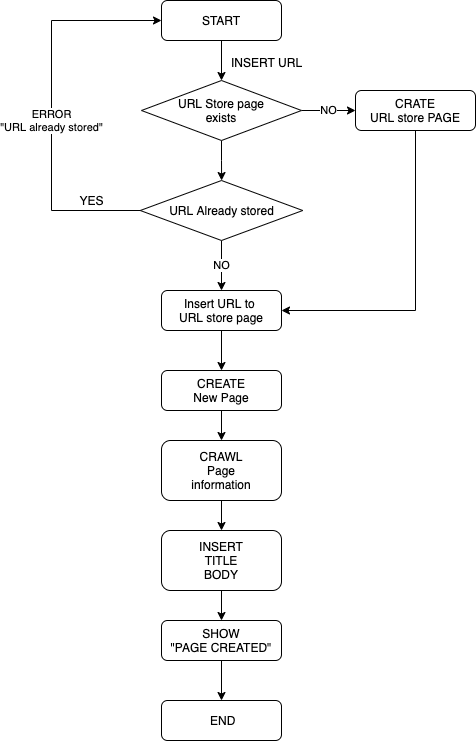

# About this repository
This repository is for implementing personal search engine using [Scarpbox](https://scrapbox.io/)

# Related Systems
TrackThink : https://github.com/ubi-naist/TrackThink

# System Architecture

# Scrapbox API

### main

GET Page info
- api/pages/:projectname/:pagetitle
- api/pages/:projectname/:pagetitle/text
- api/pages/:projectname/:pagetitle/icon
- api/pages/:projectname/search/titles
- api/code/:projectname/:pagetitle/:filename
- api/table/:projectname/:pagetitle/:filename.csv
- api/page-snapshots/:projectname/:pageid
- api/commits/:projectname/:pageid

Search with query
- api/pages/:projectname/search/query
- api/projects/search/query
- api/projects/search/watch-list

GET Project Info
- api/pages/:projectname
- api/projects/:projectname
- api/stream/:projectname/
- api/feed/:projectname
- api/projects/:projectname/notifications
- api/projects/:projectname/invitations
- api/project-backup/:projectname/list
- api/project-backup/:projectname/:backupId.json

GET User Info
- api/users/me
- api/projects
- api/gcs/:projectname/usage

Scrapbox setting
- api/settings
- api/google-map/static-map
    - Googleマップの埋め込み

### Url
- https://scrapbox.io/help-jp/API
- https://scrapbox.io/scrapboxlab/API
- https://scrapbox.io/scrapboxlab/API%E3%81%AE%E6%9B%B8%E5%BC%8F

# Other
Q：Why not HTTP POST request allowed in Scrapbox?

A：Scrapbox is a system do not want bot to do write request in order to achieve service thought：[Ref in Japanese](https://scrapbox.io/shokai/WOM(Write_Only_Member)#5c4f85cc97c2910000a5c1f4)
